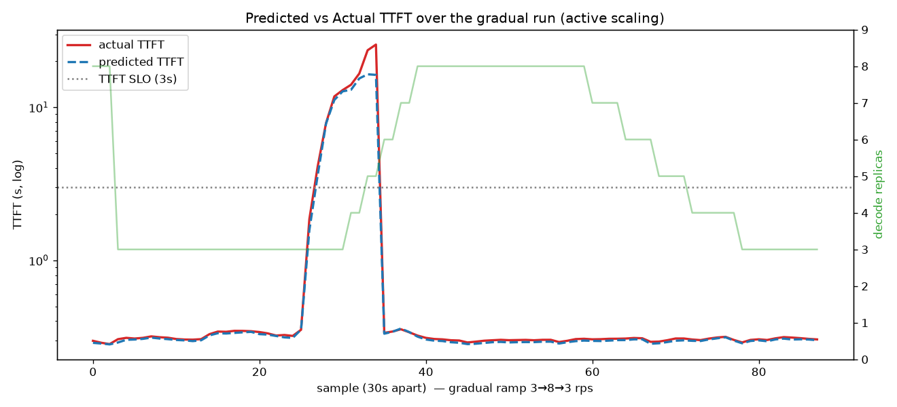
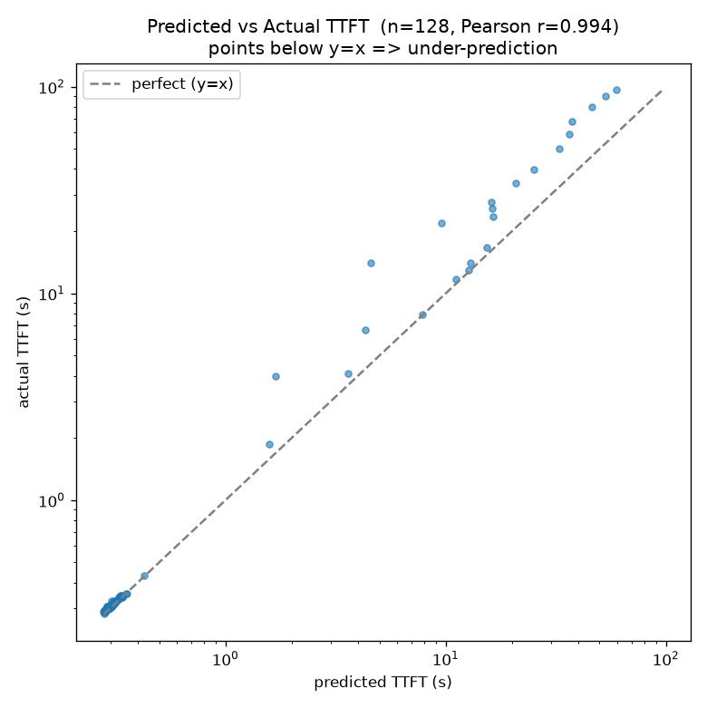

# EPP-saturation analyzer — benchmark (Prefill-Heavy, active scaling)

A first end-to-end evaluation of the `epp-saturation` analyzer driving **active**
autoscaling on GKE, against the canonical Prefill-Heavy workload. This complements
the RFC ([#1018](https://github.com/llm-d/llm-d-workload-variant-autoscaler/issues/1018))
and follows the metrics in [analyzer-checklists.md](analyzer-checklists.md).

> **Status: validated proof-of-concept, not a production sign-off.** One workload,
> one model, one cluster. See [Caveats](#caveats).

## Setup

| | |
|---|---|
| Cluster / GPU | GKE, NVIDIA H100 |
| Model | `Qwen/Qwen3-32B` (2 GPU / replica) |
| Serving | llm-d EPP (`latency-detector` plugin + latency predictor sidecars) |
| SLO | TTFT ≤ 3000 ms, TPOT ≤ 100 ms (passed per-request via `x-llm-d-slo-*-ms` headers) |
| Saturation signal | `max(predicted_ttft / TTFT_SLO, predicted_tpot / TPOT_SLO)`, 1-min mean, EMA α=0.3 |
| Scaler | WVA `epp-saturation` → `wva_desired_replicas` → prometheus-adapter → external-metric HPA |
| Bounds | minReplicas 3, maxReplicas 8; HPA scale-up +1 pod/60s, scale-down −1 pod/120s |
| Load | inference-perf, Prefill-Heavy **4000 in / 1000 out**, constant-rate ramp **3→8→3 rps**, ~40 min |

The analyzer **derives** saturation from the EPP's predicted latency rather than reading a
pre-computed gauge: the build's `llm_d_epp_flow_control_pool_saturation` stays 0 even under
heavy SLO violation (it tracks flow-control queue saturation, not predicted latency). The SLO
policy therefore lives in WVA config (`ttftSLOMs`/`tpotSLOMs`).

## Predictor accuracy (signal quality)

Predicted vs actual TTFT, sampled every 30 s across the run (n=128):

- **Pearson r = 0.994** — predicted TTFT tracks actual almost exactly.
- **Accurate at the decision boundary:** in the SLO-relevant range (TTFT ≲ 3 s) points sit on
  `y = x`. The autoscaler's scale-up decision (crossing 3 s) is made on a faithful signal.
- **Systematic under-prediction in the overload tail:** mean bias −2.1 s; at actual 96.8 s the
  predictor said 59.5 s. This is optimistic — under deep overload it under-states saturation —
  but in that regime the decision is already "scale to max," so the action is unchanged.

## SLO-attainment + cost scorecard

| Metric | Value |
|---|---|
| **TTFT attainment (≤ 3 s)** | **95.16 %** |
| **TPOT attainment (≤ 100 ms)** | **96.86 %** |
| **Combined SLO attainment** | **~95 %** (TTFT-bound) |
| TTFT P90, per-stage (inference-perf, client-side) | ≤ 2450 ms — **under SLO in every stage** |
| TTFT tail during transient (P99) | ~28 s (the ~3-min model-load warmup at the knee) |
| **Avg decode replicas (cost)** | **5.04** |
| Peak replicas | 8 |
| Cost vs static-at-peak (8 pods) | **~37 % fewer** GPU-replica-hours |

The ~5 % of requests that miss the TTFT SLO are **concentrated in the warmup transient**, not
spread across the run: per-stage P90 stays under the SLO throughout, while the windowed P99
blows out only while new replicas are loading the model.

## Scaling-behaviour findings

- **Bidirectional control works end-to-end:** derive → `wva_desired_replicas` → adapter → HPA →
  decode deployment, both directions, capped correctly at `maxReplicas` (the `ScalingCapped`
  condition fires with the uncapped recommendation in its message).
- **Scale-up is threshold-like, not proportional.** The load→saturation curve has a sharp knee:
  3 pods held fine through rate 5 (predicted TTFT ~0.35 s), then at the knee TTFT jumped to
  ~12–25 s (saturation 3–15), and `ceil(S·N/T_up)` immediately targets the max. This is the
  **super-linear queueing** the RFC flagged (`W ∝ 1/(1−ρ)`) — the *signal itself* spikes at the
  knee, so you get held-flat-then-jump, not 1→2→3 steps.
- **Scale-down is gradual** (8→7→6→…→3): it happens in the flat, low-saturation region where the
  signal is well-behaved, so it sheds one pod at a time as the EMA drifts down.
- **Model load time dominates the transient.** Decode pods take ~3 min to become Ready (no model
  cache), so every scale-up has a ~3-min actuation lag during which SLO is violated regardless of
  analyzer quality. Predictive scaling's ~1-min lead helps but cannot close the full gap.

## Caveats

This is a proof-of-concept, not a production validation:

1. **No baseline comparison yet** — attainment/cost is reported for WVA alone; not vs static or
   HPA-on-queue. The relative win is the real question.
2. **One workload / model / cluster** (Prefill-Heavy 4000/1000, Qwen3-32B, H100).
3. **Warmup-bound transient** (~3-min model load, no cache) caps achievable attainment during steps.
4. **Scale-up overshoot risk** from the super-linear knee — needs scale-up stabilization tuning.
5. **Signal coupling is build-specific** — metric names (`llm_d_epp_*`), the SLO-in-WVA config, and
   the histogram-mean were fit to a specific EPP dev build; predicted-TPOT wasn't initially exposed.

## Reproducing

Raw time series: [`assets/epp-saturation/prefill-heavy-timeseries.csv`](assets/epp-saturation/prefill-heavy-timeseries.csv)
(columns: ts, sat_raw, sat_smoothed, wva_desired, current_replicas, predTTFT_s, actTTFT_s, actTPOT_s, …).
Attainment is computed as `request_ttft_seconds_bucket{le="3.0"} / _count` (note: Prometheus stores
`le="3.0"`, not `"3"`); cost as the mean of `current_replicas` over the run.
