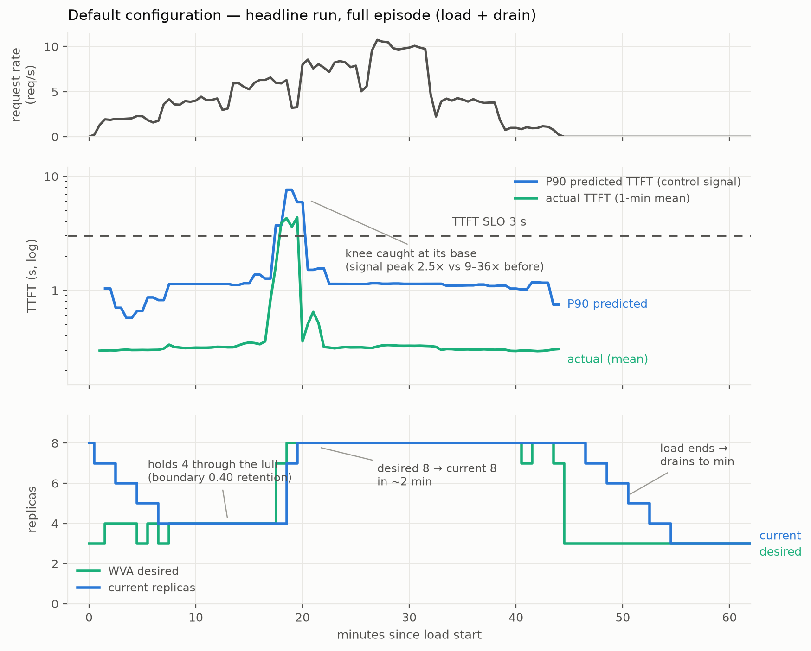
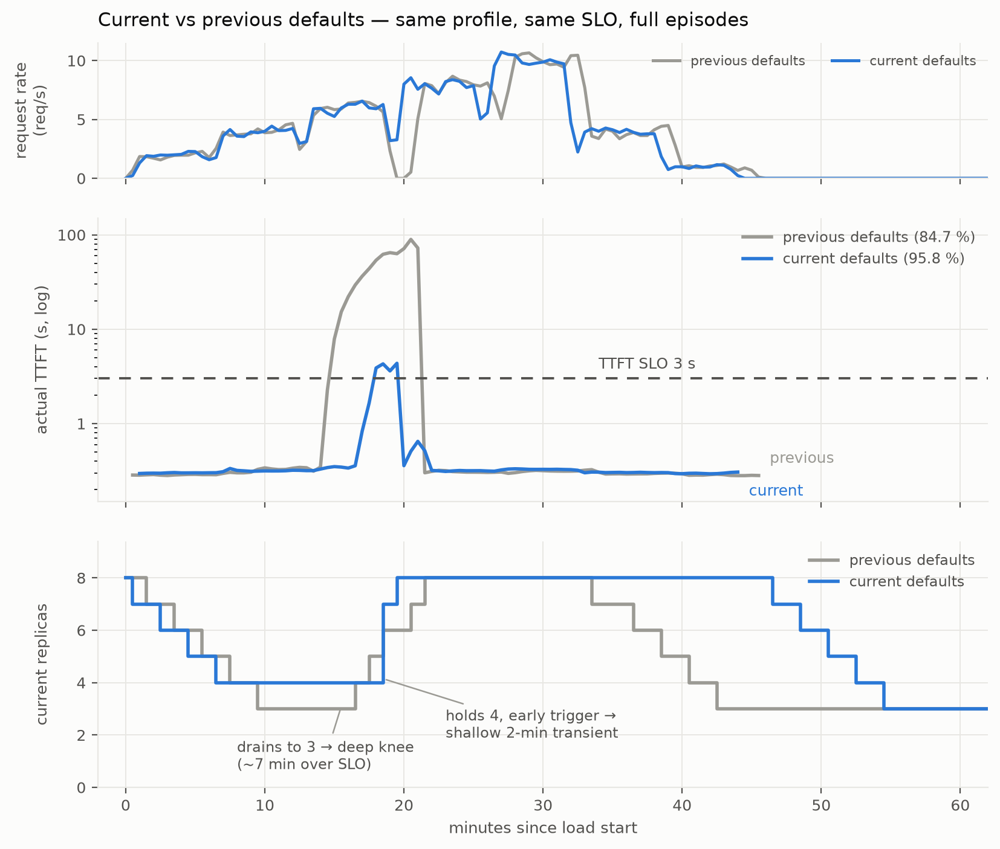

# EPP-saturation analyzer — benchmark (Prefill-Heavy, active scaling)

An end-to-end evaluation of the `epp-saturation` analyzer driving **active**
autoscaling on GKE, against the canonical Prefill-Heavy workload. Complements RFC
([#1018](https://github.com/llm-d/llm-d-workload-variant-autoscaler/issues/1018))
and the metrics in [analyzer-checklists.md](analyzer-checklists.md).

## Setup

| | |
|---|---|
| Clusters / GPU | GKE, 3× a3-highgpu (8× H100 80 GB each); benchmark reproduced on a second identical cluster after spot preemption |
| Model | `Qwen/Qwen3-32B` (TP=2, 2 GPU / replica) |
| Serving | llm-d EPP (default optimized-baseline plugins + predicted-latency producer, online-trained latency-predictor sidecars), standalone routing |
| SLO | TTFT ≤ 3000 ms, TPOT ≤ 100 ms (per-request via `x-llm-d-slo-*-ms` headers) |
| Signal | `saturation = max(P90 predTTFT / TTFT_SLO, P90 predTPOT / TPOT_SLO)`, 1-min window, clamped at `saturationCap`, EMA-smoothed |
| Scaler | WVA `epp-saturation` → `wva_desired_replicas` → prometheus-adapter → external-metric HPA → decode Deployment |
| Bounds | minReplicas 3, maxReplicas 8 (= measured peak demand) |
| Load | inference-perf, Prefill-Heavy **4000 in / 1000 out**, staged ramp **2→4→6→8→10→4→1 rps**, ~42 min, warm-start protocol |

## Headline result

WVA (default configuration, calibrated predictor) vs a peak-sized static pool:

| | WVA | static-at-peak (8) |
|---|---|---|
| **TTFT attainment (≤ 3 s)** | **95.9 %** | 100 % |
| **Combined SLO attainment** | **95.8 %** | 100 % |
| TTFT violations (of 12 480 requests) | **515** | 0 |
| **Avg replicas — full episode** | **5.93** | 8 |
| Avg replicas — 42-min load window | 6.55 | 8 |
| Cost vs static-at-peak | **~26 % fewer** GPU-replica-hours | — |

WVA trades ~4 SLO points for ~26 % lower cost. Client-side per-stage
percentiles confirm the residual violations sit in one shallow transient at the
rate-6 crossing (stage p90 = 5.1 s); the **rate-10 peak stage ran cleaner than
the idle stages** (p90 = 0.59 s) because capacity was in place before it
arrived.

*Top: measured request rate (the staged ramp, with inference-perf's
between-stage drains visible). Middle: the P90 control signal rises ahead of
the actual mean and crosses the trigger at the knee's base — the whole
excursion above the 3 s SLO lasts ~2 samples. Bottom: the pool holds 4 through
the lull (boundary retention), `desired` jumps 4→8 in one cycle and `current`
follows within ~2 minutes (the gap between the lines is the total actuation
delay), and after the load ends the pool drains back to minReplicas.*

## The configuration, knob by knob

The violation bill of a reactive autoscaler is structural:

> **violations ≈ (trigger lag + ask lag + grant lag + warmup) × arrival rate at
> the capacity crossing.**

Each term was attacked separately across the benchmark campaign, and each fix
alone was worth ≤ 1–2 minutes; only the composition, triggered early enough,
collapsed the window. Every knob below removes one measured term:

| knob | value | removes |
|---|---|---|
| signal = **P90** predicted latency (not mean) | built-in | trigger lag, signal half — the mean stays flat at any healthy utilization and only rises after the queue exists; the P90 rises as soon as queueing variance appears |
| `scaleUpThreshold` | **0.55** (code default) | trigger lag, threshold half — fires on the P90 pre-rise. A higher threshold (e.g. 0.85 → 2.55 s predicted TTFT) is only reached once the pool is already queueing, i.e. after the incident has started |
| `scaleDownBoundary` | **0.40** (code default) | lull drain — healthy loaded pools read P90 ≈ 0.35–0.45, so they retain replicas through lulls; idle pools (≈ 0.1) still shed |
| `smoothingAlpha` | **0.6** (code default) | ask lag — EMA reaches the clamp in 1–2 cycles (safe because `saturationCap` bounds spikes; that is the clamp's job) |
| `saturationCap` | 2.0 (code default) | EMA poisoning — knee signals reach 10–90× SLO; magnitude above ~2× carries no information and delays recovery |
| HPA scaleUp | `Max(100 %, 4 pods)/60 s` (operator-side) | grant lag — the whole ask lands in one step; pods warm in parallel |
| vLLM compile-cache on node-local hostPath + 5 s startupProbe (operator-side) | deployment | warmup — pod-ready ~100 s instead of ~2 m 15 s |

Measured at the knee: trigger → full capacity in **~2 minutes** (previous
configurations: 4–6 min), and the raw signal peaked at **2.5** versus 9–36 in
every earlier run — the knee was caught at its base.

The signal-side values are the analyzer's **code defaults**; the HPA policy and
the warmup fixes live in operator-owned objects and are documented here as the
reference deployment — they ship, with the full deploy order and the EPP plugin
configuration, in
[`config/samples/epp-saturation-benchmark/`](../../config/samples/epp-saturation-benchmark/). The threshold band is calibrated to the P90 signal's
measured healthy range on this workload — a workload whose SLO sits close to
its base latency shifts that band upward and should raise the thresholds
accordingly.

## Predictor calibration is part of the control loop

The latency predictor trains online, and its calibration state materially
changes autoscaling quality — measured directly by running the identical
configuration twice on a fresh cluster:

| | cold predictor (first ~40 min of traffic) | calibrated predictor |
|---|---|---|
| Combined attainment | 85.6 % | **95.8 %** |
| Cost (42-min window) | 6.51 | 6.55 |

Ten attainment points from calibration alone. Mechanism: the signal levels sit
within ±0.05 of the retention boundary, and a miscalibrated predictor puts them
on the wrong side (the pool drained to 3 before the ramp instead of holding 4).
Operationally: **after an EPP/predictor restart, expect degraded scaling
decisions until the predictor has seen representative traffic**, and treat a
persistent calibration shift as a reason to re-check the threshold band.

## Caveats

1. One workload shape / model / GPU class (Prefill-Heavy 4000/1000, Qwen3-32B,
   H100 TP=2); the threshold band (0.55/0.40) is calibrated to this signal's
   measured healthy floor and should be re-derived per workload.
2. The predictor-calibration sensitivity (finding above) means results depend
   on predictor training state; the headline uses a calibrated predictor.
3. Violations scored from EPP-side counters (`llm_d_epp_request_slo_violation_total`);
   denominators cross-checked against the load generator's own report (exact
   match, 12 480). Client-side per-request scoring (`per_request: true`) is a
   follow-up.
4. Scrape loss aliases as idle (empty query → 0 saturation, by design for
   idle pools) — a broken scrape under load scales toward minReplicas with
   `MetricsAvailable=True`. An `up{}` guard is deferred.
5. Multi-variant model groups report `ScalingCapped=False` rather than Unknown
   (cap detection is single-variant only today).

## Reproducing

Deployment bundle (the exact VA/HPA/scrape/RBAC/warmup-patch/load objects, with
deploy order): [`config/samples/epp-saturation-benchmark/`](../../config/samples/epp-saturation-benchmark/).

Raw time series: [`assets/epp-saturation/headline-run-timeseries.csv`](assets/epp-saturation/headline-run-timeseries.csv)
(headline run) and [`assets/epp-saturation/previous-defaults-run-timeseries.csv`](assets/epp-saturation/previous-defaults-run-timeseries.csv)
(columns: ts, sat_raw, sat_smoothed, wva_desired, current_replicas, predTTFT_s, actTTFT_s, actTPOT_s, …).

- **Attainment:** snapshot `sum(llm_d_epp_request_slo_violation_total{type=…})`
  and `sum(llm_d_epp_request_total)` at run start and end; violations from the
  counter delta, denominator from the load generator's own report
  (`request_lifecycle` summary). Cross-check with
  `increase(..._bucket{le="3.0"}[window])` — note Prometheus stores `le="3.0"`.
- **Cost:** report both the fixed 42-min-window average (cross-run comparable)
  and `avg_over_time(wva_current_replicas[<episode>])` over the exact job
  start→completion window (absolute). The load generator drains between stages,
  so episodes run ~15–20 min past the nominal profile length.
- **Warm-start protocol:** pin HPA `minReplicas` to the peak count, wait for
  Ready, launch the load, then restore — an active autoscaler immediately
  drains a manually-scaled idle pool, so plain `kubectl scale` does not hold.
- **Predictor burn-in:** after any EPP/predictor restart, run the full profile
  once un-scored before collecting results.

## Future work

- **Leading-indicator blend:** add queue-depth / running-request signals
  (already exported by the EPP and vLLM) alongside the P90 latency signal —
  fires before any latency moves; the measured path to ≥ 98 % on step loads.
- **Sleep-mode warm pool:** vLLM level-1 sleep (weights in CPU RAM, wake in
  seconds) turns warmup ~0; needs a sleep/wake orchestrator and sleep-aware
  readiness so the EPP excludes sleeping pods (`VLLM_SERVER_DEV_MODE` endpoints).
- Client-side per-request SLO scoring; additional workload shapes; multi-variant
  cap semantics; scrape-health guard.

## Appendix: findings

1. **The knee is a step function, and all violations live in one transient.**
   Continuous batching absorbs load with almost no latency movement until
   ρ ≈ 1 (measured per-pod capacity ≈ 1.4–1.5 rps for this workload), then the
   TTFT-vs-load curve goes vertical. Every configuration's violations sat in a
   single window where a load step crossed the drained pool's capacity.
2. **A mean-latency signal is a trailing indicator by construction** — the
   queue must exist before the mean rises. The P90 rises with queueing
   variance, before the mean, providing the only config-reachable early
   warning. Leading indicators (queue depth, running-request count) would fire
   earlier still — top follow-up.
3. **Threshold placement must match the signal's dynamic range.** The healthy
   band of the P90 signal is ≈ 0.2–0.45 of a 3 s SLO; scale-up at 0.85 means
   "act after the cliff". The same 0.4-style threshold on the *mean* signal
   fails (finding 2): alignment is signal-specific.
4. **Faster HPA grants alone change nothing** (84.2 % vs 84.7 %): the ask is
   EMA/credit-gated, so grants were never the bottleneck. Symmetrically, extra
   `maxReplicas` headroom is wasted under a trailing signal — capacity beyond
   peak-size cannot arrive in time to matter. Size `maxReplicas` at measured
   peak demand.
5. **HPA scale-down stabilization windows operate on recommendation history**,
   not replica history — an idle-started pool gets no protection from them, and
   lull retention is better expressed in the signal boundary (`scaleDownBoundary`
   vs the healthy-load floor) than in HPA behavior.
6. **Warmup decomposition** (measured): ~65 s process/CUDA/NCCL init + 11 s
   weights + 33 s torch.compile + 8 s graph capture + up-to-30 s probe lag.
   The compile cache is container-ephemeral by default and vLLM writes it under
   `$HOME` — mount a node-local hostPath at `VLLM_CACHE_ROOT` and tighten the
   startupProbe to 5 s: pod-ready ~100 s (first pod per node still pays full
   compile).
7. **Ramp-rate perspective:** this profile's slope (+0.33 rps/min) is 4× slower
   than the pool's reactive capacity growth (~1.45 rps/min once triggered). The
   danger is not the slope but discontinuous steps landing on a drained pool.
   Smooth ramps are easy; retry storms and launch spikes need floors or warm
   pools, not better reactivity.

## Appendix: full experiment frontier

All runs: same profile, same SLOs, warm-start protocol unless noted.

| configuration | attainment | cost | takeaway |
|---|---|---|---|
| **default configuration (P90, 0.55/0.40, α 0.6, burst, fast warmup)** | **95.8 %** | **5.93 (episode)** | headline; knee caught at its base |
| default configuration, cold predictor | 85.6 % | 6.51 | calibration is part of the loop |
| previous defaults (mean signal, 0.85/0.50, α 0.3, +1 pod/min) | 84.7 % | 5.89 | best of the pre-P90 configs |
| previous defaults, cold start (3) | 83.8 % | 4.92 | cheapest; pays full knee |
| P90 signal alone (0.85 threshold) | 85.1 % | ~5.9 | early trigger wasted without the rest of the pipeline |
| composition (P90 + α 0.6 + burst, 0.85 threshold) | 81.0 % | 5.77 | pipeline fast, trigger ignored the pre-rise for 6 min |
| burst grants alone (cap 12) | 84.2 % | 7.14 | grants aren't the bottleneck; ask is signal-gated |
| below-knee thresholds on the **mean** signal (0.4/0.25) | 80.2 % | 6.75 | mean has no pre-knee band; knee moved to peak rate |
| clamp + warmup-hold (step load, micro-benchmark) | — | — | hold cuts peak 11→8 on steps but **falls behind ramps** (79 % scored) — shipped default-off |

## Appendix: earlier defaults

Before the threshold band was aligned to the P90 signal, the analyzer's
defaults (`0.85 / 0.50`, α 0.3, mean-based signal) measured **84.7 % at ~5.9**
on this profile — the trigger fired past the queueing knee and every scale-up
paid the full transient. Those runs are retained in the experiment frontier
appendix; these values are now the code defaults.

*Same profile, same SLO. Previous defaults (gray) drain to 3 during the lull
and pay a ~7-minute knee that peaks near 100 s TTFT — the request-rate panel
shows their delivered throughput collapsing during it; the current defaults
(blue) hold 4, trigger on the pre-rise, and their transient peaks at ~5 s for
about two minutes.*
