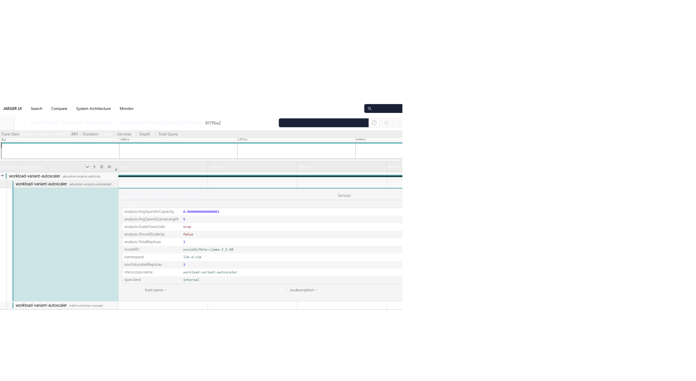

# OpenTelemetry (OTEL) Integration

WVA can be configured to send traces to OpenTelemetry collector. This guide shows the steps to configure WVA for an OpenTelemetry collector.

## Step 1: Start an OTEL collector
Start an OTEL collector such as `jaegertracing`. In the following example, the collector listens on port `4317` which is the default port for `gRPC`.
```
docker run \
  -e COLLECTOR_OTLP_ENABLED=true \
  -p 16686:16686 \
  -p 4317:4317 \
  jaegertracing/all-in-one:latest \
  2>&1 | tee collector-output.txt # Optionally tee output for easier search later
``` 

## Step 2: Configure WVA Controller
You can configure WVA controller either by editing the `charts/workload-variant-autoscaler/values.yaml` file WVA source directory and use `helm` to `install` or `upgrade`; or use `kubectl` to edit the `workload-variant-autoscaler-variantautoscaling-config` configmap in the namespace which WVA controller is installed.
### Editing values.yaml
The following example shows how to configure for an OTEL collector running on `172.18.0.1`. Note `insecureSkipVerify` is set to `true` in this example since the OTEL collector was started without TLS:
```
 # OpenTelemetry(OTEL) Configuration (Optional)
  # OTEL grpc target endpoint (no scheme or path) e.g. example.com:4317
  otel:
    targetEndpointGrpc: "172.18.0.1:4317"
    tls:
      insecureSkipVerify: true   # Development: true, Production: false
      caCertPath: "/etc/ssl/certs/otel-ca.crt"
      # caCert: |  # Uncomment and provide your CA certificate
      #   -----BEGIN CERTIFICATE-----
      #   YOUR_CA_CERTIFICATE_HERE
      #   -----END CERTIFICATE-----
```

### Editing WVA Controller Configmap
If WVA controller is already installed, you can configure OTEL integration by editing the `workload-variant-autoscaler-variantautoscaling-config` configmap and restart WVA controller pods. The following example assumes WVA controller was installed in `wva-ns` namespace:
```
kubectl edit cm workload-variant-autoscaler-variantautoscaling-config -n wva-ns
```
and the configmap should contain:
```
    # OpenTelemetry(OTEL) Configuration (Optional)
    # OTEL grpc target endpoint (no scheme or path) e.g. example.com:4317
    OTEL_TARGET_ENDPOINT_GRPC: "172.18.0.1:4317"
    OTEL_TLS_INSECURE_SKIP_VERIFY: "true"
    OTEL_CA_CERT_PATH: "/etc/ssl/certs/otel-ca.crt"
```

## Step 4: Check WVA Controller Log
Once WVA controller is restarted and picked up the latest values from configmap changes, verify OTEL SDK has been initialized successfully by getting WVA controller log which should contain:
```
2026-02-27T00:17:08Z    INFO    setup   telemetry/telemetry.go:136      OpenTelemetry setup finished successfully     {"targetEndpointGrpc": "172.18.0.1:4317", "otelInsecureSkipVerify": true, "otelCaCertPath": "/etc/ssl/certs/otel-ca.crt"}
```

## Step 5: Check OTEL Output
After about one minute, browse to `http://172.18.0.1:16686/search`, you should see:

Click on one of the spans:


